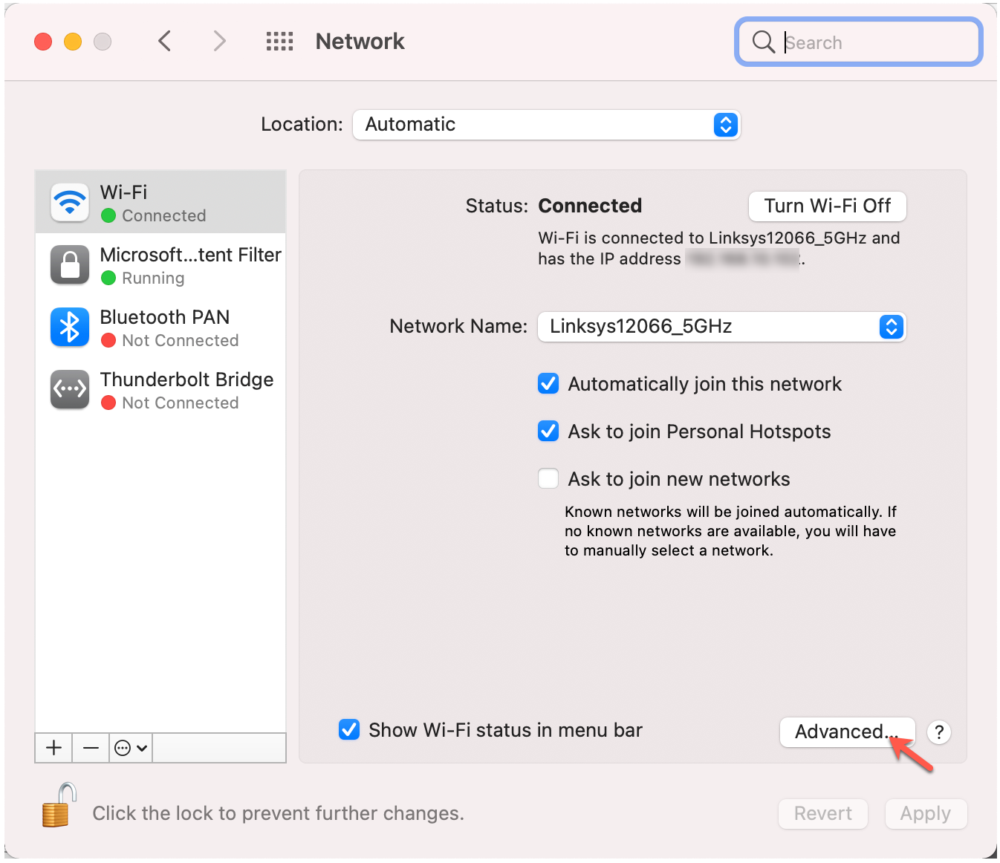
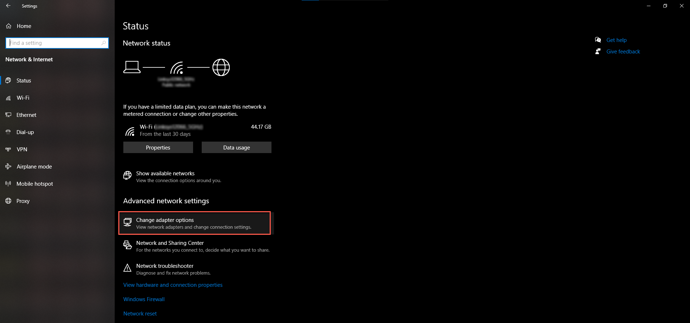
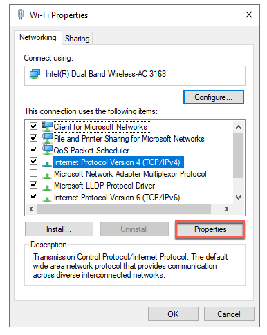
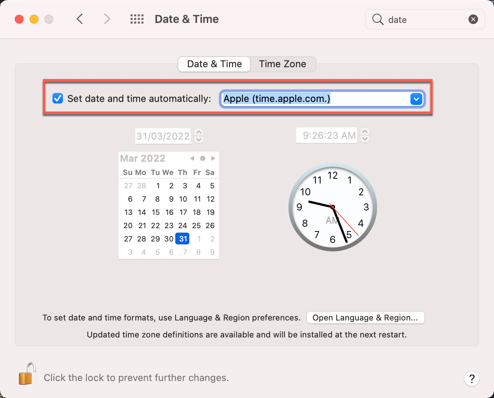

# Troubleshoot access issues with Cloudflare WARP

 Unable to browse the internet using Cloudflare WARP

Check if you are connected to any VPN. If you are still connected to your VPN, you may not be able to access the internet as it conflicts with your DNS resolver configuration. 

**To resolve this** 

1. Disconnect from your VPN.
2. Make sure only Cloudflare WARP is connected.

     

Unable to browse the internet when Cloudflare WARP automatically reconnected.

If you disconnect Cloudflare WARP on your device, it  automatically gets reconnected after three hours. At that time, if you are connected to your VPN, you may not be able to access the internet as it conflicts with your DNS resolver configuration.

**To resolve this**:

1. Disconnect the device from your WiFi.
2. Reconnect device to your WiFi to reset the DNS resolver settings or restart your device.

In addition, make sure the VPN configuration does not route all the traffic and DNS queries to the VPN server. Our recommendation is not to turn on WARP and the VPN at the same time.

     

Unable to access a particular website. I get an <em>Access restricted</em> error or <em>DNS error</em> while accessing this website.

**The following can cause this issue**:

- Gateway may have blocked these sites as WARP works with Cloudflare Gateway to block websites that are identified as malware sources or a security risk as per our security policy.

- DNS resolution for the website may fail because of WARP and Gateway.

**To resolve gateway issues for trusted sites**

1. Turn off WARP.
2. Ensure Microsoft Defender is running to protect your device against malware.

?> Note WARP connection will automatically reconnect after three hours.

**To resolve DNS error for your device**

macOS

1. Go to **Apple** menu > **System Preferences** > **Network**.

<kbd></kbd>

2. Select **Wi-Fi** from the left pane and click **Advanced**.

?> If the lock icon at the lower left appears locked, click it to unlock the preference pane.

<kbd></kbd>

3. Go to the **DNS tab** and click the plus icon.

<kbd></kbd>

4. Enter 1.1.1.1 and click the plus icon again.

<kbd></kbd>

5. Enter 1.0.0.1 and click **OK**.

<kbd></kbd>

6. Click **Apply**

<kbd></kbd>

7. Restart your browser and verify if you can access the SEED-trusted websites such as GCC 2.0 CMP and any secured public website.
8. If you still cannot access SEED-trusted websites, [create a support request][raise-support-request].

 

Windows

1. Select **Start** > **Settings** > **Network & Internet**.

<kbd></kbd>

2. In the **Status** page, under **Advanced network settings** , select **Change adapter options**. The **Network Connections** page is displayed.
3. Right-click **Wi-Fi** and select **Properties**.

<kbd></kbd>

4. Select **Internet Protocol Version 4(TCP/IPv4)** and click **Properties**.

<kbd></kbd>

5. In the **General** tab, select **Use the following DNS server addresses**.

<kbd></kbd>

?> Note down your existing settings for future reference.

6. Enter **1.1.1.1** as **Preferred DNS server** and **1.0.0.1** as **Alternate DNS server** addresses.

<kbd></kbd>

7. Click **OK** and exit the window.
8. Restart your browser and verify if you can access the SEED-trusted websites such as GCC 2.0 CMP and any secured public website.
9. If you still cannot access SEED-trusted websites, [create a support request][raise-support-request].

     

 While accessing a website, I get an <em>Access restricted</em> error followed by "Your access to this domain has been blocked as the domain has been identified as a Content Risk by Cloudflare". What can I do?

Cloudflare WARP works with Cloudflare Gateway to block websites that may have been classified under security risk categories.

**To identify Cloudflare category of a domain**:

1. Go to [Cloudflare Radar](https://radar.cloudflare.com/categorization-feedback/).
2. Enter the domain name of the website and check the categories under which it is classified. For more information on categories and their definitions, refer to [Cloudflare DNS categories](https://developers.cloudflare.com/cloudflare-one/policies/filtering/dns-policies/dns-categories/).
3. If the domain is incorrectly classified, select the relevant categories and click **Submit** to provide your feedback.

     

While using some tools and applications with Cloudflare WARP Client, why do I get SSL errors?

Your tool or application may be using a certificate store that is separate from the trusted root certificate store of your system.

  1. Download the Cloudflare CA certificate to your root system store(s) from the [Cloudflare documentation page][install-cloudflare-cert-operating-system].
  2. Refer to your CLI tool documentation and configure it to trust the Cloudflare root certificate.
  3. You can also refer to the following links for instructions to configure your tool or application:
     * [GovTech instructions for commonly used CLI tools across Singapore
       Government developers][config-cli-tools-with-warp], or
     * [Cloudflare instructions for configuring commonly used developer CLI
       tools][install-cloudflare-cert-applications].

Unable to access the GCC 2.0 Cloud Management Portal, or a Singapore Tech Stack service using my GMD.

If you are unable to access the GCC 2.0 CMP or any SGTS service using your GMD, do the following:

1. Confirm the following:
    - If you have received the successfully onboarded email from DEEP.
    - If you are using only the [supported browsers](additional-resources/best-practices).
    - Ensure that Cloudflare WARP client is updated to the latest version and is connected. Go to Cloudflare WARP **Settings**, and ensure that **Gateway with WARP** is selected.
    - If Tanium is listed in the **Start** menu for Windows and in **Finder** > **Applications** for macOS.
    - If your device operating system is updated to the latest version.
    - If Defender is up-to-date and in the running state.
    - If your TechPass account has the required permissions to access the GCC 2.0 CMP or a particular SGTS service.

2. Make sure the VPN configuration does not route all traffic and DNS queries to the VPN server. We recommend not to turn on WARP and the VPN at the same time.

If you still have issues, [Generate diagnostic report](https://docs.developer.tech.gov.sg/docs/security-suite-for-engineering-endpoint-devices/#/faqs/how-to-generate-and-upload-diagnostic-files-to-incident-support-request) and upload it to the [incident support request][raise-support-request].

I intermittently experience the error message: "<em>That account does not have access</em>" when accessing SGTS services using Cloudflare WARP.

This is a known issue with Cloudflare WARP. If you are unable to access any SGTS service, do the following:

1. Confirm the following:
    - If you have received the successfully onboarded email from DEEP.
    - If you are using only the [supported browsers](additional-resources/best-practices).
    - Ensure that Cloudflare WARP client is updated to the latest version and is connected. Go to the Cloudflare WARP **Settings**, and ensure that **Gateway with WARP** is selected.
    - If Tanium is listed in the **Start** menu for Windows and in **Finder** > **Applications** for macOS devices.
    - If your device operating system is updated to the latest version.
    - If Defender is up-to-date and in the running state.
    - If your TechPass account has the required permissions to access the GCC 2.0 CMP or a particular SGTS service.
    - If you have restarted your machine.

2. Make sure the VPN configuration does not route all traffic and DNS queries to the VPN server. We recommend not to turn on WARP and the VPN at the same time.

If you still have issues, [Generate diagnostic report](https://docs.developer.tech.gov.sg/docs/security-suite-for-engineering-endpoint-devices/#/faqs/how-to-generate-and-upload-diagnostic-files-to-incident-support-request) and upload it to the [incident support request][raise-support-request].

Tanium client returns a 400 Bad Request Error when contacted by the Cloudflare Access landing page via localhost. What should I do? 

This is due to the time synchronisation issue between Cloudflare and Tanium client. To fix this, resynchronise the local time of your macOS or Windows machine.

To check and synchronise your device time with the internet time server:

  

For macOS device

   1. From the **Apple** menu, go to **System Preferences** > **Date & Time**.
   2. Click the lock icon and use your Touch ID or enter your password to unlock.
   3. Select the **Set date and time automatically** checkbox.
   4. To use a custom network time server, enter the domain name of the server in the .
   
  

  

For Windows device

    1. Open the **Start** menu and click **Settings**.
    1. Choose **Time & Language**.
    1. Turn on **Set time automatically**.
    1. Click **Sync now** to synchronise with the time server.
    1. If you’d like to use a custom network time server, click **Date, time & regional formatting** from **Related Settings** at the upper-right corner. The **Region** settings page is displayed.
    1. Click **Additional date, time & regional settings** from **Related settings** at the upper-right corner. The **Clock and Region settings** page is displayed.
    1. Click **Date and Time**.
    1. Go to the **Internet Time** tab and select **Change settings**.
    1. Enter the domain name of the server.

  

  
  
  

  

  
Can I request to include IP addresses or domains in the Cloudflare WARP split tunnel list to exclude them from going through WARP and redirect them to go though other VPN?

  We strongly encourage agencies to avoid requesting for split tunnel allowlisting to reduce or prevent harmful security attacks. However, if you still intend to allow a VPN IP, [create a support request to request](https://go.gov.sg/seed-techpass-support). Our team may need additional information to evaluate this request.

  For more information, refer to [split tunnel allowlist](additional-resources/split-tunnel-allowlist).

  

  

  

  
What happens when I request for split tunnel allowlisting?

  We will assess the split tunnel allowlisting requests on a case-by-case basis to ensure that the request does not compromise GCC 2.0 or SGTS applications.

  As part of our security review processes, we will periodically review split tunnel entries to check if they are still necessary.

  For more information, refer to [split tunnel allowlist](additional-resources/split-tunnel-allowlist).

  

  

  

[raise-support-request]: raise-an-incident-support-request.md
[install-cloudflare-cert-operating-system]: https://developers.cloudflare.com/cloudflare-one/connections/connect-devices/warp/install-cloudflare-cert/#add-the-certificate-to-your-system
[config-cli-tools-with-warp]: faqs/configuration-of-common-developer-cli-tools-with-cloudflare-warp
[install-cloudflare-cert-applications]: https://developers.cloudflare.com/cloudflare-one/connections/connect-devices/warp/install-cloudflare-cert/#adding-to-applications

[cloudflare-troubleshooting]: https://developers.cloudflare.com/cloudflare-one/faq/teams-troubleshooting/
