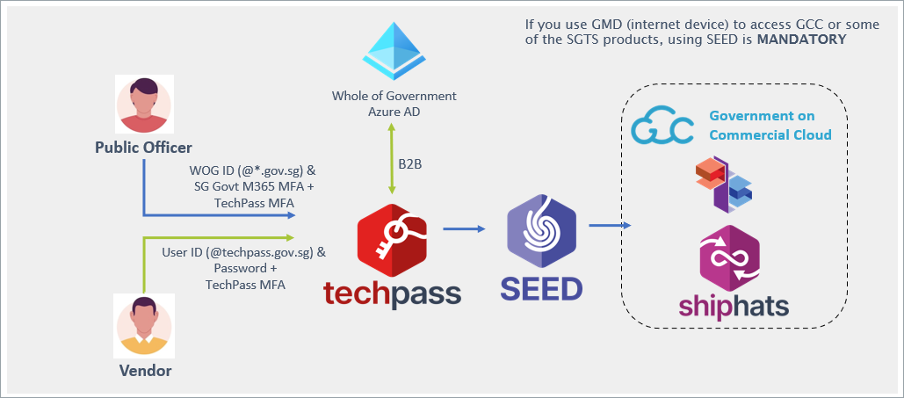

# SEED overview

## What is SEED?

**Security Suite for Engineering Endpoint Devices (SEED)** is the Singapore Government's implementation of Identity and Access Management (IAM) and Zero Trust framework.  It aims to protect the Government's engineering resources, such as Government on Commercial Cloud (GCC) and the Singapore Government Tech Stack (SGTS), against unauthorised access.

Zero Trust replaces traditional Virtual Private Network (VPN) connections and network-based security policies with a standardised central identity provider. TThis enforces access policies, ensuring that only authorised users with devices compliant with device postures gain access.

## Why do we need SEED?

- Detects and provides remediation steps for known malware.
- Verifies if the endpoint meets the required security hardening baseline based on the corresponding Centre of Internet Security (CIS) benchmark for the installed endpoint operating system.
- Detects if the endpoint’s operating system version and security patches are up to date.
- Prevents access to the resources of GCC and the SGTS services if the above requirements are not satisfied.

## How does SEED work?

SEED comprises three key components:

- TechPass
- Cloudflare
- SEED Dashboard

## What can SEED do on my device?

| SEED capabilities                            | Supported |
| ----------------------------------------------------------- | :-------: |
| View device information such as model number and OS version |     ✔️     |
| View the names of installed applications                 |     ✔️     |
| Identify your device by name                       |     ✔️     |
| Reset a lost or stolen device to factory settings          |     ✔️     |
| View browsing history                              |     ❌     |
| Access emails, contacts, and calendar                     |     ❌     |
| Access documents                                         |     ❌     |

