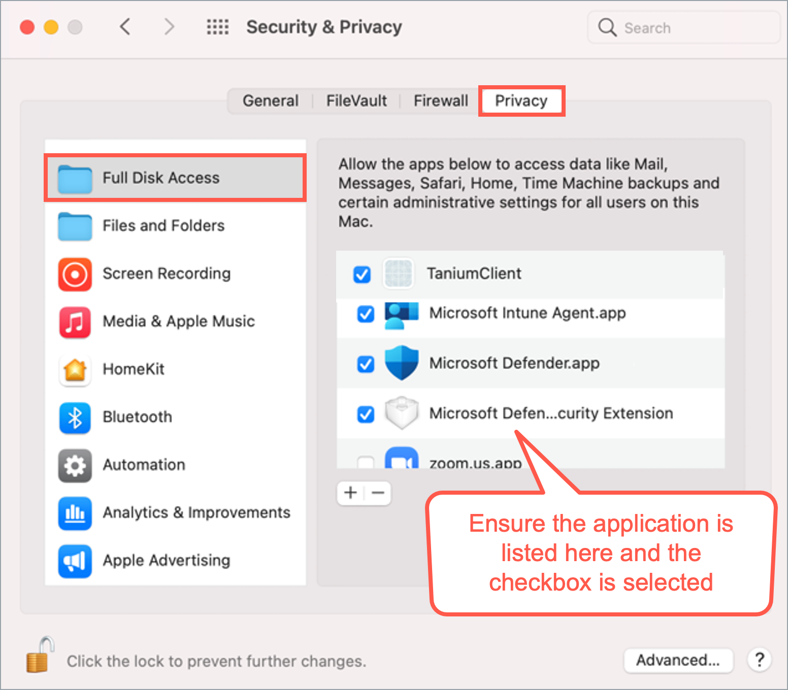
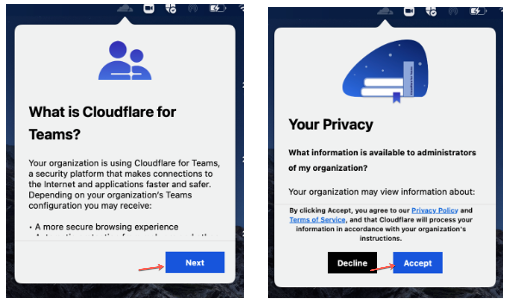

# Post onboarding instructions for macOS 12

  After onboarding your Internet Device to SEED, follow these instructions: 

  - [Ensure Full Disk Access(FDA) is enabled for SEED components](#ensure-full-disk-accessfda-is-enabled-for-seed-components)
  - [Turn on Cloudflare WARP for macOS](#turn-on-cloudflare-warp-for-macos)

## Ensure Full Disk Access (FDA) is enabled for SEED components

After onboarding, ensure FDA is enabled for the following SEED components:

  - Tanium Client
  - Microsoft Intune Agent
  - Microsoft Defender
  - Microsoft Defender ATP Security Extension 

**Verification steps**:

1. Go to the **Apple** menu > **System Preferences** > **Security & Privacy**.
2. Click the **Privacy** tab.
3. From the left pane, select **Full Disk Access**.
4. Click the lock icon at the bottom and unlock it using your Touch ID or by entering your password.

?> **Note** If you were not prompted to reset device password while onboarding, you will be prompted now. See FAQ for password policy.

5. Ensure the following applications are listed and enabled (checkboxes should be selected):
    - Tanium Client
    - Microsoft Intune Agent
    - Microsoft Defender
    - Microsoft Defender ATP Security Extension 

?> **Note** If a SEED component is missing, see [Common onboarding issues for macOS users](faqs/common-onboarding-issues) to resolve it.

## Turn on Cloudflare WARP for macOS

After onboarding your macOS Internet Device to SEED, you need to activate Cloudflare WARP.

**Activation Steps**:

1. Open **Cloudflare WARP** client from the menu bar.

 
  
You will see the information page, followed by the privacy policy.

2. Click **Next**, **Accept** to agree to Cloudflare’s privacy policy.

3. When prompted to sign in, select **Azure AD – TechPass Prod**.

If you encounter an error stating that your user account is not found in the respective tenant, follow these instructions:

- Open a new browser tab
- Visit https://myaccount.microsoft.com
- Sign out of your current account
- Retry the action

4. Sign in using your TechPass credentials.

5. After successfully signing in, click **Open Cloudflare WARP app** to establish your WARP connection.

Once connected, you should see WARP Zero Trust in the connected state.
  

6. Open Cloudflare WARP **Settings**, and ensure **Gateway with WARP** is selected.

WARP is now active, safeguarding your Internet connection.

